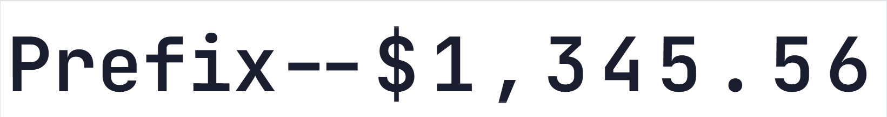

<p align="center">
  
  
</p>

<h1 align="center">Smart Ticker</h1>

  High-performance smart text ticker component based on Levenshtein diff algorithm. Supports CJK, numbers, letters, emojis, and mixed charsets. <a href="https://tombcato.github.io/smart-ticker/">Live Demo ></a>

<p align="center">
  <a href="./README.md">简体中文</a> | <strong>English</strong>
</p>
<p align="center">
  Supports any characters
  
</p>
<p align="center">
  Supports Prefix/Suffix, Intl Formatting, Auto-Scale, Fading Edges
  
</p>
<p align="center">
  
</p>


<p align="center">
  
  
  
  
</p>


| | |
| :--- | :--- |
| **🌏 Multi-Charset Support**<br>Supports CJK, Numbers, Emojis, and mixed text rolling. Auto-adjusts spacing based on Unicode width. | **🧠 Smart Diff Animation**<br>Uses Levenshtein algorithm to find the shortest change path; identical characters remain static. |
| **⚡ Smooth Interruption**<br>Seamlessly transitions to new targets if the value changes dynamically during animation. | **📈 Rich Motion**<br>Built-in variety of easings.Supports custom easing function. Supports `charWidth` fine-tuning. |
| **🦄 Dual Framework**<br>Provides both React (Hooks) and Vue 3 (Composition) components with a unified API. | **🚀 High Performance**<br>Powered by `RAF`, supporting **Auto-scale**, **Fading Edge**, and **Disable Animation**. |

## 📦 Installation

### NPM (Recommended)

```bash
npm install @tombcato/smart-ticker
```

### From Source

```bash
# Clone repository
git clone https://github.com/tombcato/smart-ticker.git

# Install dependencies
cd smart-ticker
npm install

# Start dev server
npm run dev
```

## 🚀 Usage

### 📦 Import Styles

When using **NPM**, you **MUST** explicitly import the style file for the component to work.

```javascript
import '@tombcato/smart-ticker/style.css'
```

> **Source Integration**: If copying source code, ensure React version imports `Ticker.css` and Vue version uses the built-in styles.

### React

```tsx
// NPM Usage
import { Ticker } from '@tombcato/smart-ticker';
import '@tombcato/smart-ticker/style.css';

// Source Usage
// import { Ticker } from './components/Ticker';

function App() {
  const [price, setPrice] = useState(73.18);

  return (
    <Ticker
      value={price.toFixed(2)}
      duration={800}
      easing="easeInOut"
      charWidth={1}
      characterLists={['0123456789.,']}
    />
  );
}
```

### Vue

```vue
<script setup>
// NPM Usage
import { Ticker } from '@tombcato/smart-ticker/vue';
import '@tombcato/smart-ticker/style.css';

// Source Usage
// import Ticker from './components/vue/Ticker.vue';

import { ref } from 'vue';

const price = ref('73.18');
</script>
<template>
  <Ticker
    :value="price"
    :duration="800"
    easing="easeInOut"
    :char-width="1"
    :character-lists="['0123456789.,']"
  />
</template>
```

### 💅 Customization

#### Custom Fonts

The component uses the system monospace stack by default. To use a custom font (e.g., `JetBrains Mono`), ensure it is **monospace** and override via CSS:

```css
/* In global styles or component styles */
.ticker {
  font-family: 'JetBrains Mono', monospace !important;
}
```

> **Note**: Must be a **monospace font**, otherwise alignment issues may occur during scrolling animations.

## ⚙️ API

### Props

| Prop | Type | Default | Description |
|------|------|--------|------|
| `value` | `string`\|`number` | - | The text value to display (Required) |
| `duration` | `number` | `500` | Animation duration (ms) |
| `easing` | `EasingName \| function` | `'easeInOut'` | Easing: `linear`, `easeIn`, `easeOut`, `easeInOut`, `bounce`, or custom `(t: number) => number` |
| `direction` | `string` | `'ANY'` | Scroll direction: `UP`, `DOWN`, `ANY` (shortest path) |
| `charWidth` | `number` | `1` | Character width multiplier (base 0.8em) |
| `characterLists` | `string[]` | `['0123456789']` | Allowed character sets |
| `className` | `string` | `''` | Custom CSS class name |
| `animateOnMount` | `boolean` | `false` | Animate on initial render |
| `disableAnimation` | `boolean` | `false` | Disable animation, show final value immediately |
| `autoScale` | `boolean` | `false` | Enable auto-scaling to fit container width |
| `fadingEdge` | `boolean` | `false` | Enable top/bottom fading edge effect |
| `prefix` | `string` | - | Static prefix (not animated) |
| `suffix` | `string` | - | Static suffix (not animated) |
| `numberFormat` | `Intl.NumberFormat` | - | Intl formatter number `value` |
| `onAnimationEnd` | `() => void` | - | Callback when animation ends (Vue: `@animation-end`) |


### 🧩 Character Configuration (characterLists)

`characterLists` controls the core animation logic. It accepts an array of strings, where each string represents a group of characters that can **scroll into each other**.

#### Presets (Common Character Lists)
For convenience, we provide built-in constants for common character sets:

```ts
import { Presets } from '@tombcato/smart-ticker';

Presets.NUMBER        // '0123456789'
Presets.ALPHABET      // 'abcdefghijklmnopqrstuvwxyzABCDEFGHIJKLMNOPQRSTUVWXYZ'
Presets.ALPHANUMERIC  // '0123456789abcdefghijklmnopqrstuvwxyzABCDEFGHIJKLMNOPQRSTUVWXYZ'
Presets.CURRENCY      // '0123456789.,'
```

#### Animation Rules
1.  **Scroll**: If both the old and new characters belong to the same group string (e.g., `0` to `9` in `Presets.NUMBER`), they will scroll.
2.  **Switch**: If they are in different groups, or if a character is not in any list (e.g., Chinese characters), they will switch instantly (fade/flip) without scrolling.

#### Configuration Tips
*   **Common Use Case**: Simply use `Presets.ALPHANUMERIC` to support most alphanumeric scrolling.
*   **Case Isolation**: To prevent scrolling between cases (e.g., `a` -> `A`), list them as separate groups: `[Presets.NUMBER, 'abc...', 'ABC...']`.

**Code Example:**

```tsx
<Ticker
  value={val}
  characterLists={[
    Presets.NUMBER,                 // Numbers
    'abcdefghijklmnopqrstuvwxyz', // Lowercase Group
    'ABCDEFGHIJKLMNOPQRSTUVWXYZ', // Uppercase Group
    '.,!@#$%^&*'                  // Symbols
  ]}
/>
```

## 💻 Running Demos

This project includes complete NPM-based user examples for React and Vue in the `examples` directory.

### Start React Demo

```bash
cd examples/react-demo
npm install
npm run dev
# Demo runs at http://localhost:5179
```

### Start Vue Demo

```bash
cd examples/vue-demo
npm install
npm run dev
# Demo runs at http://localhost:5180
```

## 📁 Project Structure

```
smart-ticker/
├── src/
│   ├── components/
│   │   ├── Ticker.tsx      # React Component Source
│   │   ├── Ticker.css      # Component Core Styles
│   │   └── vue/
│   │       └── Ticker.vue  # Vue Component Source
│   ├── core/
│   │   └── TickerCore.ts   # Core Logic (Levenshtein diff algo)
│   └── ...
├── examples/               # Standalone Example Projects
│   ├── react-demo/         # React Demo (Vite + React + TS)
│   └── vue-demo/           # Vue Demo (Vite + Vue + TS)
├── public/
│   └── vue-demo.html       # Single File CDN Demo
└── package.json
```

## 🎨 Example Scenarios

- **Financial Data** - Stock prices, crypto rates
- **Counters** - Page views, likes
- **Scoreboards** - Real-time sports scores
- **Airport Info** - Flight numbers, gates
- **Privacy Mode** - Balance hide/show toggle

## 🔧 Tech Stack

- **Build Tool**: Vite
- **Language**: TypeScript
- **Frameworks**: React 18 / Vue 3
- **Styling**: CSS Variables + Responsive Design

## 📝 Changelog

See [CHANGELOG_EN.md](./CHANGELOG_EN.md) for version history.

## 📄 License

MIT
